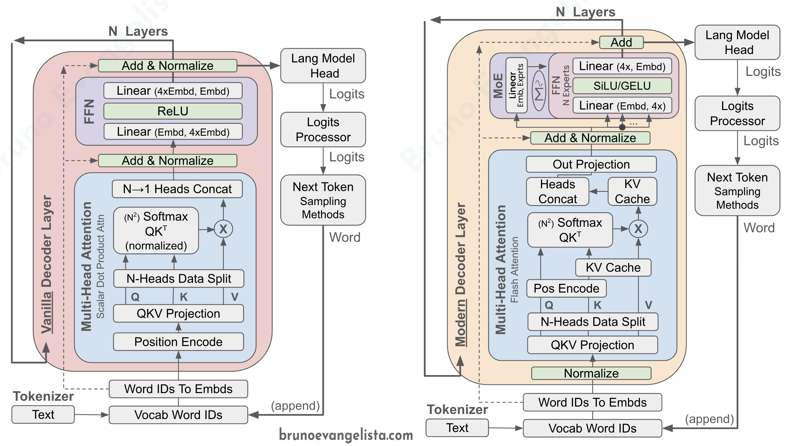

# ML – From Scratch to Llama2, Mistral and Phi-2 Pytorch Code

### Background

<summary>RNN (1986), LSTM (1997), GRU (2014), Attention for Sequence Learning</summary>

Sequence learning is used to learn from sequence data such as texts, audio and
video. Sequence data is hard due to <b>order dependency</b> and <b>variable
length</b>. Recurrent Neural Networks (RNN) were state-of-the-art (SOTA) in
sequence learning.

RNNs vs Feed-Forward Networks (FNNs):
[[Ref1](https://www.geeksforgeeks.org/difference-between-feed-forward-neural-networks-and-recurrent-neural-networks/)],
[[Ref2](https://stats.stackexchange.com/questions/2213/whats-the-difference-between-feed-forward-and-recurrent-neural-networks)].

|              | Feed Forward                                | Recurrent                          |
|--------------|---------------------------------------------|------------------------------------|
| Input Length | Fixed                                       | Variable                           |
| Data Flow    | One-way, Top-Down<br>(IN -> hidden0 -> OUT) | Directed Graph<br>(feedback loops) |
| Generation   | Parallel<br>Many Per Iteration              | Sequential<br> One Per Iteration   |


RNNs are effective at short-term dependencies but struggle with long-term dependencies due to vanishing and exploding gradients.

Long Short-Term Memory (LSTM), a RNN variant, mitigate this issue with memory cells and gating that allow information to be retained over over longer intervals, thousands of steps earlier. [[Ref](http://colah.github.io/posts/2015-08-Understanding-LSTMs/)]. 

Gated Recurrent Unit (GRU), another variant, simplify the LSTM architecture by combining the forget and input gates into a single update gate. 
[[Ref](https://towardsdatascience.com/illustrated-guide-to-lstms-and-gru-s-a-step-by-step-explanation-44e9eb85bf21)]

However, both LSTM and GRU remain limited by sequence length, requiring large networks and considerable processing time to expand the dependency window. (TODO Add Ref)

Prior to the Transformers architecture, attention was another technique explored to improve modeling of dependencies in RNNs. [[Google's Neural Machine Translation](https://arxiv.org/abs/1609.08144), [Ref](https://arxiv.org/abs/1601.06733)]
</br></br>

### Transformer Model (2017) – Multi-Head Self-Attention & FFN/MLP

[Attention Is All You Need Paper](https://arxiv.org/pdf/1706.03762.pdf)



```python
# Transformer parameters
vocab_size = 32 * 1024  # 32K words/tokens embeddings in vocabulary
embedding_dim = 4096    # 4096 embedding dimension (dmodel)
max_seq_length = 2048   # 2048 maximum input tokens
```

#### Positional Encoding

```python
def build_absolute_positional_encoding_naive() -> torch.Tensor:
    positions = torch.arange(max_seq_length)    # [0,1,2, ... max_seq_length]
    positions = positions.unsqueeze(1)          # [0,1,2, ... max_seq_length][]
    embeddings = torch.arange(embedding_dim)    # [0,1,2, ... embedding_dim]
    
    # pos/10000^(2i/dmodel)
    angle = positions / torch.pow(10000, (2 * embeddings / embedding_dim))
    
    # PE(pos, 2i+0) = sin( pos/10000^(2i/dmodel) )
    # PE(pos, 2i+1) = cos( pos/10000^(2i/dmodel) )
    positional_encoding = torch.empty(max_seq_length, embedding_dim)
    positional_encoding[:, 0::2] = torch.sin(angle[:, 0::2])
    positional_encoding[:, 1::2] = torch.cos(angle[:, 1::2])
    return positional_encoding
```

#### Multi-Head Attention

```python
# q, k, v – layers were learned during training
q = nn.Linear(embedding_dim, embedding_dim, bias=False)
k = nn.Linear(embedding_dim, embedding_dim, bias=False)
v = nn.Linear(embedding_dim, embedding_dim, bias=False)

def multi_head_attention_naive(input_embd: torch.Tensor,
                               num_heads: int) -> torch.Tensor:
    q1 = q(input_embd)
    k1 = k(input_embd)
    v1 = v(input_embd)

    seq_length = input_embd.size(0)
    head_length = embedding_dim // num_heads

    # We work on per-head sequences (no batching for now)
    # Rearrange data as [num_heads, seq_length, head_length]
    q2 = q1.view(seq_length, num_heads, head_length).transpose(0, 1)
    k2 = k1.view(seq_length, num_heads, head_length).transpose(0, 1)
    v2 = v1.view(seq_length, num_heads, head_length).transpose(0, 1)

    # q * k_transposed / sqrt(dk)
    dk = head_length
    qk = q2.matmul(k2.transpose(1, 2)) / math.sqrt(dk)

    # out = softmax(qk) * v (no out projection for now)
    mh_attn = nn.functional.softmax(qk, dim=-1)
    mh_attn_out = mh_attn.matmul(v2)

    # Rearrange data back as [seq_length, embedding_dim] 
    mh_attn_out = mh_attn_out.transpose(0, 1).reshape(seq_length, embedding_dim)
    return mh_attn_out
```

#### Normalization

```python
# Does mean and std normalization, then applies learned weight and bias
post_attn_norm_layer = nn.LayerNorm(embedding_dim) # learnable
post_ffn_norm_layer = nn.LayerNorm(embedding_dim) # learnable

def post_attention_norm(input_embd: torch.Tensor) -> torch.Tensor:
    return post_attn_norm_layer(input_embd)

def post_feed_forward_norm(input_embd: torch.Tensor) -> torch.Tensor:
  return post_ffn_norm_layer(input_embd)
```


#### Feed Forward (aka MLP)

```python
ffn_linear1 = nn.Linear(embedding_dim, 4 * embedding_dim)
ffn_linear2 = nn.Linear(4 * embedding_dim, embedding_dim)
ffn_act = nn.ReLU()
ffn_drop = nn.Dropout(0.0) # Training-only, discard X% to avoid overfit
  
def feed_forward_naive(input_embd: torch.Tensor):
    hidden_states = ffn_linear1(input_embd)
    hidden_states = ffn_drop(ffn_act(hidden_states))
    hidden_states = ffn_linear2(hidden_states)
    return hidden_states
```


#### Everything Together (Naive)

```python
prompt = 'Which fruits do you like?'
input_ids = tokenizer.encode(prompt, return_tensors="pt")
positional_encoding = build_absolute_positional_encoding_naive()

while not has_finished:
    hidden_states = vocab_embedding(input_ids)

    for layer in decoder:
        residual = hidden_states

        seq_length = hidden_states.size(0)
        hidden_states = hidden_states + positional_encoding[:seq_length]

        hidden_states = multi_head_attention_naive(hidden_states, num_heads=32)
        hidden_states = residual + post_attention_norm(hidden_states)

        hidden_states = feed_forward_naive(hidden_states)
        hidden_states = residual + post_feed_forward_norm(hidden_states)

    logits = lm_head(hidden_states)
```

### Multi-Head Self-Attention (2024) SOTA Implementations

[Efficient Attention Reference List](https://gwern.net/note/attention#state)

Research Implementations
- O(n) instead of O(n^2) time and space<br />
[2022: Rethinking Attention with Performers](https://arxiv.org/pdf/2009.14794.pdf)<br />
[2021: Self-attention Does Not Need O(n2) Memory](https://arxiv.org/abs/2112.05682)<br />


Production Implementation (Jan24): (Huggingface Transformers, vLLM)

```python
qkv_weight = torch.cat((q_proj, k_proj, v_proj), dim=0)

hidden_states = vocab_embedding(input_ids) # [batches, seq_length, embedding_dim]
batches = hidden_states.size(0)
seq_length = hidden_states.size(1)

# Shared Attention Preamble Processing
def mha_proj_and_pos_encode(hidden_states: torch.Tensor, position_ids: torch.Tensor, num_heads: int):
    # QKV Projection
    qkv = F.linear(hidden_states, qkv_weight)
    query, key, value = qkv.split([embedding_dim, embedding_dim, embedding_dim], dim=-1)

    # Relative Rotary Position Embedding
    query, key = apply_rotary_pos_emb(query, key, position_ids)

    # Note: Non KV-Cached Step

    # Multi-Head Reshape. [batch, seq, embd] -> [batch*seq, num_heads, head_size]
    query = query.view(-1, num_heads, head_size)
    key = key.view(-1, num_heads, head_size)
    value = value.view(-1, num_heads, head_size)
    return query, key, value
```

```python
# XFormers Memory Efficient Attention
def mha_xformers(hidden_states: torch.Tensor, position_ids: torch.Tensor, num_heads: int) -> torch.Tensor:
    query, key, value = mha_proj_and_pos_encode(hidden_states, position_ids, num_heads)
    
    # Causal Attention Mask (all seqs have same length due to padding) 
    attn_bias = BlockDiagonalCausalMask.from_seqlens([seq_length] * batches)

    mh_attn_out = xformers.ops.memory_efficient_attention_forward(
        query.unsqueeze(0), key.unsqueeze(0), value.unsqueeze(0), attn_bias=attn_bias,
    )

    mh_attn_out = mh_attn_out.reshape(batches, seq_length, embedding_dim)
    mh_attn_out = F.linear(mh_attn_out, out_proj)
    return mh_attn_out
```

```python
# Torch SDPA Attention
def mha_sdpa(hidden_states: torch.Tensor, position_ids: torch.Tensor, num_heads: int) -> torch.Tensor:
    query, key, value = mha_proj_and_pos_encode(hidden_states, position_ids, num_heads)

    mh_attn_out = torch.nn.functional.scaled_dot_product_attention(
        query, key, value, attn_mask=None, is_causal=True,
    )

    mh_attn_out = mh_attn_out.reshape(batches, seq_length, embedding_dim)
    mh_attn_out = F.linear(mh_attn_out, out_proj)
    return mh_attn_out
```
Test: 100 iterations of 32 attention layers (xavier_normal_ initialized)
- Baseline (Naive)   
- ~2.5x - xformers speed-up
- ~3.5x - sdpa speed-up

## LLMs References and Innovations

### GPT Model (2018, OpenAI) 
- ~120M parameters
- Encoder Only


### Transformer-XL (2019, Google)
- KV-Cache


### GPT-2 & 3 (2019~2020, OpenAI) 
- ~1.5B and ~175B parameters respectively


### Switch Transformer (2021, Google)
- Mixture of Experts on FFN


### S4 (2021, Stanford)
- https://srush.github.io/annotated-s4/

### Llama-1 & 2 (2023, Meta)
- Moved Back RMS Normalization
- Rotary Positional Encoder (Q, K only)
- Group Query Attention on 34B/70B
- SwiGLU instead of RELU


### Mistral-1 (2023, Mistral)
- Sliding Window Attention (4096 tokens)
- Sliding KV-Cache
  - KV-Cache Pre-Fill & Chunking
- FFN with Sparse Mixture of Experts
  - 8x FFN/MLP Models, 2x Used Per-Token
- SiLU (Sigmoid Linear Unit) instead of RELU
- Others
  - Byte-fallback Tokenizer
  - Model Partition
  - Efficient Queries Batching/Bundling


### Phi1 & 2 (2023, Microsoft)
- 2.5B parameters
- TODO


### Mamba (2023, Stanford)

https://github.com/havenhq/mamba-chat

https://arxiv.org/abs/2312.00752


TODO Good
Images [Ref](https://bitshots.github.io/Blogs/rnn-vs-lstm-vs-transformer/)
